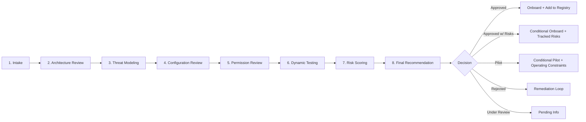

## 1. 🧠 MCP Threat Landscape

### 1.0 The core framing principle

> **An MCP server does not create new access. It amplifies existing access by making it callable via an LLM.**

This is the lens through which every MCP audit should begin. The MCP server inherits the permissions of whatever credentials it is given. The "new" risk introduced by adopting MCP is not that the server can do anything the credentials could not already do — it is that:

- those actions are now reachable through **natural-language requests** from any user the client trusts;
- those actions are now driven by an **LLM susceptible to prompt injection** from any data the server reads;
- those actions are now **chained automatically** with other tools the same client can call.

Therefore: **scoping the credentials is the audit's single highest-leverage control**, and deployment model (who runs the server, where, with whose identity) is part of that scope. A perfectly hardened MCP server given a `*:*` token is more dangerous than a sloppy MCP server given a read-only token to two dashboards.

### 1.1 Specific attack surface

Before applying the checklist, the reviewer should internalize the unique attack surface of MCP. The three "poisoning" vectors below are deliberately separated because each demands a different control:

1. **Description Poisoning** *(vector: tool description / schema)*. Tool metadata (name, description, parameter docs) is part of the LLM's input. A malicious or compromised description can hijack model behavior before any tool is even invoked. Mitigation: schema review at audit, manifest hash-pinning, internal forks, immutable registry.
2. **Execution Poisoning** *(vector: tool implementation code)*. The tool description is benign but the underlying code executes secondary, hidden behavior (data exfil, dropper, etc.). Mitigation: static analysis, supply-chain verification, sandboxed execution, internal forks.
3. **Prompt Injection via Response** *(vector: tool output / fetched content)*. Tool descriptions and code are clean, but the *data the tool returns* (a fetched page, a ticket body, a log line) contains injected instructions. This is the most common production failure mode. Mitigation: untrusted-content boundary markers, scoped data sources, no instruction-following on tool output, output classification labels.
4. **Tool output is LLM input.** Anything a tool returns becomes part of the model's context and can carry injected instructions. The MCP server is not just an API — it is a **prompt injection delivery surface**.
5. **Tool descriptions are LLM input.** See "Description Poisoning" above — re-emphasized because most reviewers underestimate it.
6. **Capabilities are dynamic.** Tools can be added, removed, or renamed after initial connection. Approval at T0 ≠ safety at T30. *(Dynamic Tool Modification — the "rug pull" attack.)*
7. **The MCP server is a confused deputy.** It typically holds a service account or OAuth token to backend systems. A clever prompt can cause it to perform actions the *user* could not perform directly. Token passthrough — insecurely forwarding a client token to downstream APIs — is the canonical anti-pattern.
8. **Cross-server interference.** A client connected to multiple MCP servers can leak data from Server A through Server B (e.g., "use the email tool to send the contents of the database resource"). Tool name collisions allow shadowing.
9. **Local transport ≠ safe transport.** stdio-based MCP servers run as child processes — command-injection and binary-provenance risks apply.
10. **Sampling and elicitation features** (where the server requests LLM completions or user input mid-flow) reverse the trust direction and require explicit review.
11. **Long-lived sessions** carry state, tokens, and accumulated context — session hijack and replay attacks apply.

---

## 2. 🚦 Audit Workflow

The audit is an **8-phase, gated process**. Each phase has explicit entry criteria, deliverables, and reviewer sign-off.




### Phase 1: Intake
**Entry:** Sponsor submits MCP Intake Form.
**Reviewer collects:**
- Server name, owner, sponsor team, business justification.
- Source (vendor / OSS repo / internal build) and version/commit hash.
- Transport (stdio / SSE / Streamable HTTP / WebSocket).
- Hosting model (on user endpoint / internal K8s / vendor SaaS).
- Data classifications the server will touch (Public / Internal / Confidential / Restricted).
- Identity model (service account / per-user OAuth / personal access token).
- Tool inventory (name + description + side-effect summary).
- Expected user population (single team / org-wide).

**Deliverable:** Intake page created, status = `Under Review`.

### Phase 2: Architecture Review
- Diagram trust boundaries (client ↔ server ↔ downstream).
- Identify where credentials live and what scope they hold.
- Identify all egress paths (DNS, HTTP, DBs, message buses).
- Identify where tool inputs/outputs are persisted (logs, caches, vector DBs).
- Map the **blast radius**: if a prompt injection succeeds, what is reachable?

**Deliverable:** Architecture section completed with diagrams.

### Phase 3: Threat Modeling
- Apply STRIDE *plus* MCP-specific categories: **Tool Poisoning**, **Indirect Prompt Injection**, **Confused Deputy**, **Cross-Server Interference**, **Rug Pull**.
- Build at least one *abuse story* per high-impact tool ("Attacker plants instructions in a Jira ticket so that `read_ticket` causes `send_email` to leak data").
- Identify any tool that combines **read-from-untrusted** + **write-to-sensitive** in a single agent loop — this is the highest-risk pattern.

**Deliverable:** Threat model section with abuse stories, mapped to controls.

### Phase 4: Configuration Review
- Walk the checklist (Section 10) against deployed config, manifests, Helm charts, Dockerfiles, IaC.
- Verify hardening (non-root user, read-only root FS, dropped capabilities, no host mounts).
- Verify TLS, cipher suites, certificate validation, auth config.

### Phase 5: Permission Review
- Enumerate every identity the server uses (IAM roles, OAuth scopes, DB grants, K8s RBAC, GitHub app permissions, etc.).
- Confirm **least privilege** against each tool's actual needs.
- Flag any wildcard, `*:*`, `Owner`, `admin`, `repo`-wide, or unscoped tokens.

### Phase 6: Dynamic Testing
Perform live testing against a non-prod instance:
- **Auth tests:** missing/expired/forged tokens, replay, downgrade.
- **Authz tests:** cross-tenant access, IDOR, privilege escalation.
- **Injection tests:** prompt injection in tool outputs and resources; tool poisoning via crafted descriptions if reviewer can modify server.
- **Tool abuse:** chain tools to reach an unsafe outcome; test the "untrusted-read → sensitive-write" pattern.
- **Network tests:** SSRF from any tool that accepts a URL; DNS rebinding for HTTP-bound servers; egress to unexpected destinations.
- **Resource exhaustion:** payload size, recursive structures, slow-loris, unbounded streaming.
- **Logging tests:** verify expected events appear; verify no secrets are logged.

### Phase 7: Risk Scoring
- Score each finding per Section 9.
- Aggregate to an overall **Residual Risk Rating**.

### Phase 8: Final Recommendation
- Decision: **Approved**, **Approved with Risks**, **Rejected**, **Under Review**.
- Trust Tier assignment (T0–T3, see §6.2).
- Re-review trigger conditions documented.

---

## 3. 🏷️ Classification & Tiering

### 3.1 Server Classification (drives audit depth)

| Class | Definition | Audit Depth |
|---|---|---|
| **C1 — First-party / Anthropic-published** | MCP server published by the foundation model vendor. | Standard checklist, light dynamic test. |
| **C2 — Reputable Vendor** | Commercial vendor under MSA + security questionnaire. | Standard checklist + vendor SIG/CAIQ + dynamic test. |
| **C3 — Open Source** | Public OSS project. | Full checklist + supply chain deep-dive + code review of high-risk tools. |
| **C4 — Internal-built** | Built by an internal team. | Full checklist + SDLC evidence + code review + threat model sign-off. |
| **C5 — Experimental / Unknown** | Pre-release, prototype, or unvetted code. | Sandbox tier only; restricted access until reclassified. |

### 3.2 Trust Tier (drives where it may run)

| Tier | Name | Where Allowed | Data Allowed | Examples |
|---|---|---|---|---|
| **T0** | Sandbox | Isolated dev environment, no prod identities | Synthetic only | Experimental servers |
| **T1** | Individual / Personal Productivity | Endpoint, single user | Internal, non-sensitive | Personal note-taking server |
| **T2** | Team Internal | Internal infra, scoped to team | Internal + Confidential (need-to-know) | Team Jira/Confluence reader |
| **T3** | Org Production | Production infra, multi-team | Up to Restricted with explicit DPIA | Org-wide knowledge base server |

A server's status (§8) and tier (§6.2) are independent: a server can be **Approved at T1** but **Rejected for T3**.

### 3.3 Audit Depth Proportionality

Not every audit needs to be exhaustive. Audit depth scales with **Classification × Requested Trust Tier × Data Sensitivity**. Reviewers should be explicit in the page about the depth applied and why.

| Combination | Audit Depth |
|---|---|
| C1–C2 server, T0–T1, Public/Internal data | **Lightweight:** Intake + mandatory controls subset (auth, scope, secrets, deployment model). Skip threat model and dynamic test unless red flags. |
| C2–C3 server, T1–T2, Internal/Confidential | **Standard:** Full Architecture Review + Threat Model + Configuration + Permission Review. Dynamic test on high-risk tools only. |
| C3–C5 server, T2–T3, any sensitive data | **Full:** All eight phases, full control catalog, code review of high-risk tools, abuse story per high-impact tool, formal sign-off chain. |
| Any server with code-execution or admin tools | **Full**, regardless of class/tier. |
| Any server touching Restricted data | **Full** + Privacy/DPIA. |

The reviewer should state in the executive summary: *"This audit was performed at **Standard** depth based on C3 × T2 × Confidential. A full audit would additionally cover X, Y, Z."* This is honest, gives readers calibration, and creates a clear trigger for deeper review if scope changes.


---

## 4. 📐 Risk Scoring Methodology

We use a **Likelihood × Impact** matrix, with an AI-specific amplification factor. Each finding is scored 1–5 on each axis.

### Likelihood (1–5)
1. Requires multiple pre-conditions and insider access.
2. Requires authenticated user + specific knowledge.
3. Authenticated user, common knowledge.
4. Any user can trigger.
5. Unauthenticated / drive-by.

### Impact (1–5)
1. Negligible (informational disclosure of public data).
2. Low (limited internal info).
3. Moderate (confidential data for one user/tenant).
4. High (confidential data org-wide; or write to production systems).
5. Critical (restricted/regulated data; broad RCE; identity compromise).

### Risk Score = Likelihood × Impact (range 1–25)

| Score | Rating | Maps to Severity |
|---|---|---|
| 20–25 | Critical | Critical |
| 12–19 | High | High |
| 6–11 | Medium | Medium |
| 1–5 | Low | Low |

### AI Impact Amplifier (+1 to Impact, max 5) — applies when ANY of:
- Finding allows untrusted data into LLM context.
- Finding allows tool/description manipulation visible to LLM.
- Finding enables chaining tools toward an outcome no single tool authorizes alone.
- Finding affects a tool that combines untrusted-read with sensitive-write.

### Residual Risk Rating (overall server)
Highest individual finding rating, capped by aggregate count:
- Any unresolved Critical → **Critical** (Reject).
- 3+ unresolved Highs → escalate to **Critical**.
- Otherwise = highest unresolved finding rating.

---

## 5. 📌 Appendix A: Quick Decision Cheat Sheet

Use only after the full checklist is done; for first-pass triage of obvious blockers.

| Observed Condition | Implication |
|---|---|
| Unauthenticated endpoint | **Reject.** |
| Service account with `Owner` / `Administrator` / `*` IAM | **Reject** until scoped. |
| Arbitrary code execution tool with no sandbox | **Reject** for any tier > T0. |
| Untrusted-read + sensitive-write tools in one session, no HITL | **Approved with Risks** at most; document compensating control or reject for T3. |
| No tool inventory, no documented data flows | **Under Review** — block until provided. |
| Vendor server, no DPA / sub-processor disclosure | **Under Review** — block until provided. |
| Tool descriptions/schemas not pinned | High finding; require CI guard before approval. |
| stdio binary unsigned / unverified provenance | High finding; require signing before approval for any C3+/T2+. |
| Embedded credentials in repo / image | **Reject** + rotate immediately. |

---

## 6. 🛑 Appendix B: Glossary of Common Anti-Patterns

| Name | Pattern | Why it's dangerous |
|---|---|---|
| **The Swiss Army Server** | One MCP server exposing read, write, exec across many systems. | Largest possible blast radius; every prompt injection lands in a privileged context. |
| **The Shared Service Account** | One backend identity used for all users. | Confused deputy; no per-user audit; over-privilege almost guaranteed. |
| **The Open Loopback** | Local server bound to `0.0.0.0`, no auth, "it's just localhost." | LAN-reachable; DNS-rebinding from browser; trivial unauthorized access. |
| **The Live-Reloading Tool List** | Server dynamically adds tools post-connection without re-consent. | Rug pull; user consent meaningless. |
| **The Echo Chamber** | Tool returns raw third-party content as model context with no labeling. | Indirect prompt injection delivery vehicle. |
| **The Sampler Trojan** | Server uses `sampling` to invoke the client's model on its own prompts. | Server steers the model invisibly; potential exfil via model calls. |
| **The Universal URL Fetcher** | A `fetch(url)` tool with no allow-list. | SSRF to cloud metadata, internal services, exfil targets. |
| **The Eternal Token** | Long-lived service tokens never rotated. | Maximum breach blast radius; minimum forensics confidence. |


---------------------------


# 1. MCP Server Review Workflow

**Reviewer Mindset**

Do not ask:

> Would the model normally call this dangerous tool?

Ask:

> Could an attacker eventually influence the model, tool output, metadata, or user context so that this dangerous tool is called?

The MCP server must remain safe even when the model is confused, manipulated, operating on malicious external content, receiving poisoned tool outputs, and even interacting with untrusted resources.

As general rules, never trust:
- Tool output
- Resource content
- Tool descriptions from untrusted sources
- User-provided URLs or file paths
- The model's intent

Always enforce security in **deterministic** server-side logic.


An MCP server does not create new access — it amplifies existing access by making it callable via an LLM.**

Scope the credentials; everything else follows.


---

## Step 1: Inventory
- Identify all tools, resources, and prompts.
- Identify backend systems and credentials.
- Identify deployment model and transport.

## Step 2: Data Flow

What systems does it connect to? What credentials does it use? What can it read/write?

Draw a simple flow:

```text
User → Host → MCP Client → MCP Server → Backend System
```

Add:
- Trust boundaries
- Credentials
- Sensitive data
- Logs
- Network paths

## Step 3: Threat Model
Ask:
- What can the LLM cause this server to do?
- What happens if prompt injection succeeds?
- What happens if tool output is malicious?
- What happens if credentials leak?

## Step 4: Code Review
Focus on:
- Tool handlers
- Auth checks
- Input validation
- File access
- Network calls
- Command execution
- Secrets
- Logging

## Step 5: Abuse Testing
Test:
- Prompt injection
- Authorization bypass
- SSRF
- Command injection
- Path traversal
- Excessive data export
- Missing confirmations

## Step 6: Risk Decision

| Decision | Meaning |
|---|---|
| Approved | No blocking issues |
| Approved with restrictions | Allowed only with documented constraints |
| Blocked | Critical findings exist |

---

# 2. Reviewer Scoring

| Result | Meaning |
|---|---|
| 0 Critical + 0 High | Usually acceptable for approval |
| Any Critical | Block production use |
| 1-3 High | Restrict deployment until mitigated |
| More than 3 High | Block broad rollout |
| Medium/Low only | Track in remediation backlog |

---
