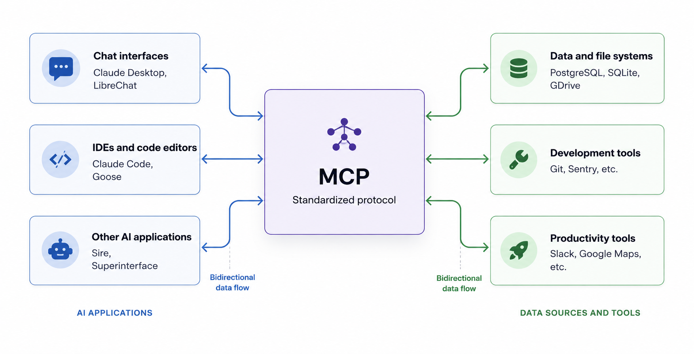

## What is the Model Context Protocol (MCP)?

MCP (Model Context Protocol) is an open-source protocol that enables AI applications to securely connect to external systems and services. Through MCP, tools like Claude or ChatGPT can interact with data sources such as local files and databases, use external tools like search engines or calculators, and integrate with custom workflows or prompts — enabling them to retrieve information and perform actions more effectively.

MCP provides a standardized way for AI applications to connect with external systems:

